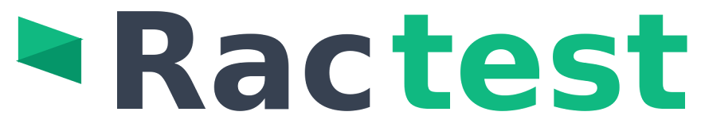

## Overview

**RacTest** is a Chrome extension for creating and running web test flows with optional AI assistance.

It helps you:

- Capture steps visually from real web pages
- Generate steps with AI from a test goal
- Run flows and review detailed execution history
- Use an autonomous Autopilot mode for goal-driven navigation/testing

## Key Features

- **AI Autopilot**: Goal-based autonomous browsing and interaction.
- **DOM Inspector**: Capture selectors and element metadata directly from the page.
- **Visual Step Authoring**: Build flows with click/type/select/check actions.
- **AI Step Generation**: Generate flow steps from prompts using OpenRouter.
- **Execution History**: Inspect run status, step traces, and runtime logs.
- **Error Monitoring**: Capture runtime and network-related signals during runs.
- **Configurable Settings**: Theme, language, delays, AI model, retries, and limits.
- **Local-First Data**: Flows, settings, and history stay on your device.

## Tech Stack

- React + TypeScript + Vite
- Tailwind CSS
- Chrome Extension APIs (MV3)
- OpenRouter API integration

## Installation

1. Clone the repository:

```bash
git clone https://github.com/DeviantRacoon/ractest-chrome-extension.git
cd rac-test
```

2. Install dependencies:

```bash
npm install
```

3. Build the extension:

```bash
npm run build
```

4. Load it in Chrome:

- Open `chrome://extensions/`
- Enable **Developer mode**
- Click **Load unpacked**
- Select the generated `dist` directory

## Usage

1. Open RacTest from Chrome.
2. Go to **Settings** and configure your OpenRouter API key (optional, required for AI features).
3. Create a new flow in **Flows**.
4. Add steps with:

- Manual capture (Inspector)
- AI generation (prompt-based)

5. Run the flow and monitor execution.
6. Review output in **History**.

## Documentation

- Product requirements: [PRD.md](PRD.md)
- Privacy policy: [PRIVACY.md](PRIVACY.md)
- Contribution guide: [CONTRIBUTIONS.md](CONTRIBUTIONS.md)

## Contributing

Contributions are welcome. Please read [CONTRIBUTIONS.md](CONTRIBUTIONS.md) before opening a pull request.

## License

Licensed under the [MIT License](LICENSE).
